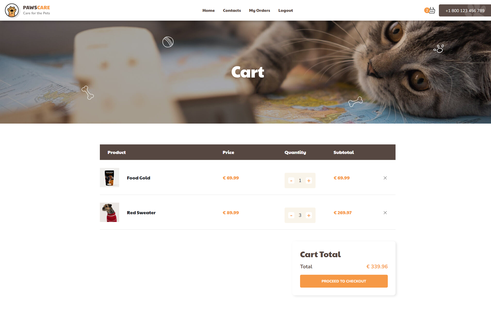
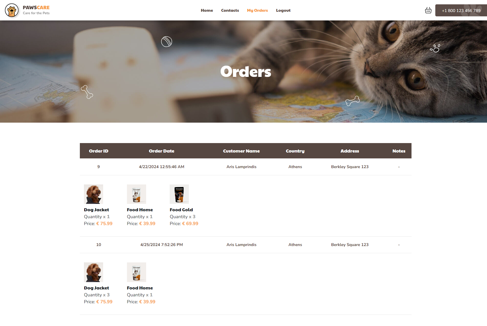

<b>Pawscare</b> is an e-commerce platform specializing in a wide range of pet-related products, including toys, food, and more. The website features a robust login and registration system, allowing users to easily access their accounts. Customers can browse detailed product information, add items to their cart, and proceed to checkout. Additionally, users have the convenience of viewing their past orders, enhancing their shopping experience.

<b>Technologies:<b/>
    Html | Css | Bootstrap | Javascript | ASP.NET Core MVC | Entity Framework | C# | MySql

    
<h3>Home</h3>

  

<h3>Login</h3>

  

 <h3>Register</h3>

  
 
<h3>Cart</h3>

  
    
<h3>Checkout</h3>

  
    
<h3>Orders</h3>

